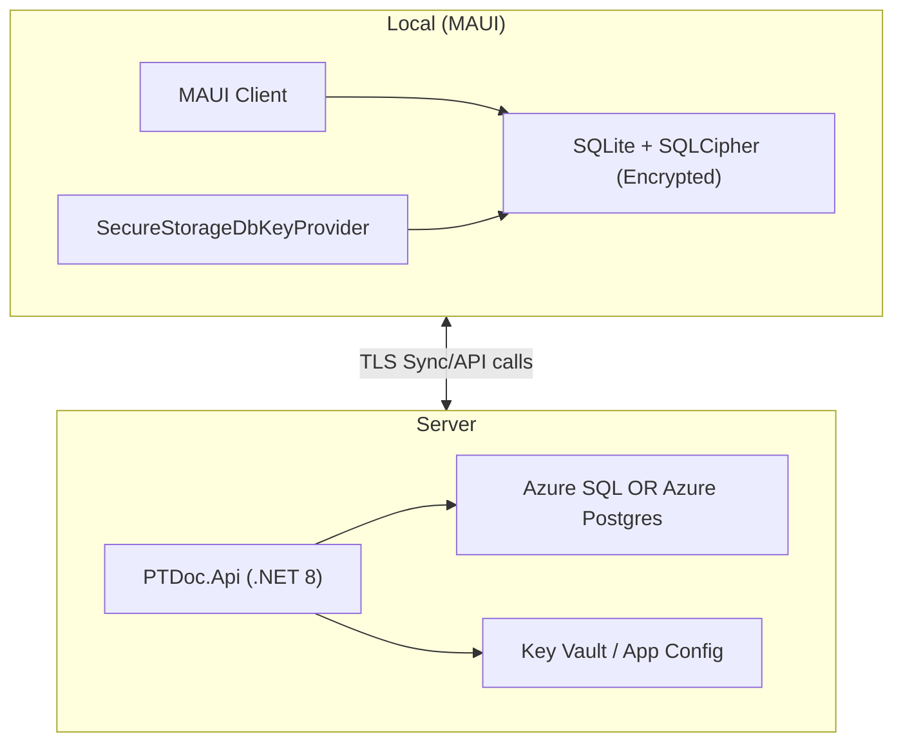
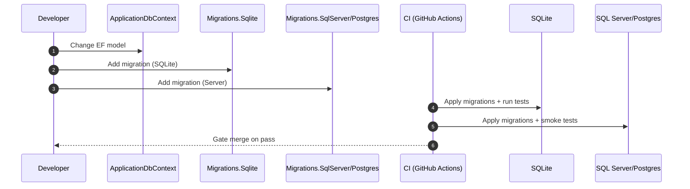

# PTDocs+ Branch-Specific Database Blueprint and Phased Plan for `UI-Completion`

## Executive summary

PTDocs+’s `UI-Completion` branch already implements a **production-leaning local/server database foundation**: a canonical EF Core `ApplicationDbContext`, an EF Core `SaveChanges` interceptor that stamps sync metadata, a **SQLite + SQLCipher-style encryption toggle** in the API, integration tests covering SQLCipher encryption and “no PHI in telemetry,” and a GitHub Actions workflow running build + tests. fileciteturn208file1

The branch is still **SQLite-first** (including migrations workflow and runtime configuration), and it is not yet structured for a production hosted database swap (Azure SQL or PostgreSQL) without rework. EF Core tooling scaffolds migrations only for the active provider; EF Core’s recommended solution for multi-provider support is to maintain **multiple migration sets (one per provider)** and add migrations to each when the model changes. citeturn5search6turn0search0

There is also a high-impact security gap: **secrets are committed in configuration** (notably JWT signing keys and other placeholders). That conflicts with Microsoft guidance to keep secrets out of source control and use dev-time secret stores and production secret managers. fileciteturn208file1 citeturn0search8

This report modifies the PTDocs+ blueprint to be **branch-specific** and gives a phased plan (sprint-level) to reach release readiness with:
- configuration-driven provider switching (SQLite local ↔ SQL Server/Postgres server),
- multi-provider migrations and CI parity gates,
- HIPAA-oriented technical safeguards mapped to actual branch insertion points (encryption, secret management, audit controls), anchored to HIPAA Security Rule requirements for access control, audit controls, integrity, authentication, and transmission security. citeturn2search1turn3search0

Assumptions (declared)
- CI is GitHub Actions (confirmed in repo workflow). fileciteturn208file1  
- Cloud/provider is not enforced by repo code; where cloud is referenced, this plan assumes **Azure SQL** or **Azure Database for PostgreSQL Flexible Server** as production DB targets. fileciteturn208file1  
- App stack: .NET 8, EF Core, MAUI client, encrypted SQLite local, server API (per your instruction).

## Branch analysis (files changed, DbContext, migrations, schema differences, config)

This section corresponds to **1) Branch analysis**.

### Files inspected in the `UI-Completion` branch

These are the primary branch artifacts reviewed for database architecture, migrations, security, and deploy readiness:

- API composition and DB wiring: `src/PTDoc.Api/Program.cs` fileciteturn208file1  
- EF Core model: `src/PTDoc.Infrastructure/Data/ApplicationDbContext.cs` fileciteturn208file1  
- Sync metadata stamping: `src/PTDoc.Infrastructure/Data/Interceptors/SyncMetadataInterceptor.cs` fileciteturn208file1  
- Migrations + snapshot: `src/PTDoc.Infrastructure/Data/Migrations/ApplicationDbContextModelSnapshot.cs` fileciteturn208file1  
- Migration workflow doc: `docs/EF_MIGRATIONS.md` fileciteturn208file1  
- MAUI DI entrypoint: `src/PTDoc.Maui/MauiProgram.cs` (not currently registering EF Core local DB) fileciteturn208file1  
- Encryption key abstractions: `IDbKeyProvider`, `EnvironmentDbKeyProvider`, `SecureStorageDbKeyProvider` fileciteturn208file1  
- Security posture docs: `docs/SECURITY.md` fileciteturn208file1  
- Sync posture docs and implementation: `docs/SYNC_ENGINE.md`, `SyncEngine.cs`, `SyncEndpoints.cs` fileciteturn208file1  
- CI workflow: `.github/workflows/phase8-validation.yml` fileciteturn208file1  
- Integration tests: encryption/no-PHI/sync persistence test suites fileciteturn208file1  

### What changed from `main` to `UI-Completion`

Using the GitHub compare between `main` and `UI-Completion`, the branch is **ahead by 2 commits** and changes are concentrated in UI and supporting build/docs (e.g., Progress Tracking UI components, `HeaderConfigurationService`, and build script/docs). There are **no DB schema/migrations files** listed among the changed files in the compare result, indicating the database layer is stable in this branch and the primary work is productionization, not schema repair.

### DbContext and schema characteristics

The canonical EF Core context is:

- `PTDoc.Infrastructure.Data.ApplicationDbContext` fileciteturn208file1  

Per the model snapshot, the schema is **SQLite-shaped** (e.g., typical `TEXT`/`INTEGER` storage and SQLite-friendly constructs like filtered indexes). fileciteturn208file1  
This is not “wrong”—it matches current provider usage—but it becomes a future risk if you deploy to SQL Server/Postgres without explicitly adopting EF Core’s multi-provider migrations strategy. EF Core tools scaffold migrations for the active provider; when using more than one provider, EF Core recommends **multiple sets of migrations** (one per provider) and adding migrations to each when the model changes. citeturn5search6turn0search0

### Migrations workflow state

Current migration documentation instructs developers to set the environment variable `EF_PROVIDER=sqlite` when running `dotnet ef` commands. That is explicitly SQLite-first and does not define a workflow for SQL Server/Postgres parity. fileciteturn208file1  

EF Core’s official guidance for multi-provider support is to maintain multiple migration sets, either by using multiple DbContext types or by using one DbContext and moving migrations to separate assemblies. citeturn5search6turn0search0

### Configuration and secrets state

Key observed configuration behaviors and issues (branch-specific):

- DB path is selected from `PTDoc_DB_PATH` env var or `Database:Path` setting; encryption is toggled via `Database:Encryption:Enabled`; encryption key is read via an `IDbKeyProvider` (env-based in API). fileciteturn208file1  
- JWT configuration including `Jwt:SigningKey` is present in config files, which is a critical security risk: secrets should not be committed. fileciteturn208file1 citeturn0search8  

## Updated local DB architecture tied to branch (exact DbContext names, provider registrations, sample appsettings snippets)

This section corresponds to **2) Updated local DB architecture tied to branch**.

### Branch-anchored target: two-plane persistence with one canonical model

To maximize compatibility with `UI-Completion`’s current implementation while enabling a production-hosted DB, the recommended architecture is:

- **Canonical EF Core model and context** remains: `ApplicationDbContext` fileciteturn208file1  
- **Local device database (MAUI)**: SQLite (encrypted with SQLCipher; key via `SecureStorageDbKeyProvider`) fileciteturn208file1  
- **Server database (API)**: SQL Server (Azure SQL) or PostgreSQL (Azure Database for PostgreSQL Flexible Server) fileciteturn208file1  

This preserves the repo’s Clean Architecture layering and avoids refactors throughout Infrastructure/Application services.

### Provider registration blueprint

The branch currently configures only SQLite (plain or encrypted). The upgrade is to introduce a configuration key `Database:Provider` with values: `Sqlite | SqlServer | Postgres`, and then select EF provider in DI.

EF Core supports keeping migrations in a separate assembly via `MigrationsAssembly(...)`, which is also the recommended way to maintain multiple migration sets when using one DbContext and multiple providers. citeturn0search0turn5search6

#### C# DbContext registration snippet (API)

```csharp
using Microsoft.Data.Sqlite;
using Microsoft.EntityFrameworkCore;
using PTDoc.Application.Security;
using PTDoc.Infrastructure.Data;
using PTDoc.Infrastructure.Data.Interceptors;
using PTDoc.Infrastructure.Security;

public static class DbRegistration
{
    public static IServiceCollection AddPtDocsDb(
        this IServiceCollection services,
        IConfiguration config,
        IHostEnvironment env)
    {
        services.AddScoped<IDbKeyProvider, EnvironmentDbKeyProvider>();
        services.AddScoped<SyncMetadataInterceptor>();

        var provider = config.GetValue<string>("Database:Provider") ?? "Sqlite";

        services.AddDbContext<ApplicationDbContext>((sp, options) =>
        {
            options.AddInterceptors(sp.GetRequiredService<SyncMetadataInterceptor>());

            if (provider.Equals("Sqlite", StringComparison.OrdinalIgnoreCase))
            {
                var dbPath = Environment.GetEnvironmentVariable("PTDoc_DB_PATH")
                    ?? config.GetValue<string>("Database:Path")
                    ?? "PTDoc.db";

                var encryptionEnabled = config.GetValue<bool>("Database:Encryption:Enabled");
                if (encryptionEnabled)
                {
                    var keyProvider = sp.GetRequiredService<IDbKeyProvider>();
                    var key = keyProvider.GetKeyAsync().GetAwaiter().GetResult();

                    var conn = new SqliteConnection($"Data Source={dbPath};");
                    conn.Open();

                    using var cmd = conn.CreateCommand();
                    cmd.CommandText = "PRAGMA key = $key;";
                    var p = cmd.CreateParameter();
                    p.ParameterName = "$key";
                    p.Value = key;
                    cmd.Parameters.Add(p);
                    cmd.ExecuteNonQuery();

                    options.UseSqlite(conn, x => x.MigrationsAssembly("PTDoc.Infrastructure.Migrations.Sqlite"));
                }
                else
                {
                    options.UseSqlite($"Data Source={dbPath};",
                        x => x.MigrationsAssembly("PTDoc.Infrastructure.Migrations.Sqlite"));
                }
            }
            else if (provider.Equals("SqlServer", StringComparison.OrdinalIgnoreCase))
            {
                var cs = config.GetConnectionString("PTDocsServer")
                    ?? throw new InvalidOperationException("Missing ConnectionStrings:PTDocsServer");

                options.UseSqlServer(cs, x =>
                {
                    x.EnableRetryOnFailure(); // recommended for transient faults
                    x.MigrationsAssembly("PTDoc.Infrastructure.Migrations.SqlServer");
                });
            }
            else if (provider.Equals("Postgres", StringComparison.OrdinalIgnoreCase))
            {
                var cs = config.GetConnectionString("PTDocsServer")
                    ?? throw new InvalidOperationException("Missing ConnectionStrings:PTDocsServer");

                options.UseNpgsql(cs, x =>
                {
                    x.EnableRetryOnFailure(); // Npgsql retry strategy
                    x.MigrationsAssembly("PTDoc.Infrastructure.Migrations.Postgres");
                });
            }
            else
            {
                throw new NotSupportedException($"Unknown Database:Provider '{provider}'");
            }

            if (env.IsDevelopment())
            {
                options.EnableDetailedErrors();
            }
        });

        return services;
    }
}
```

Why these configuration choices are production-grade:
- EF Core expects connection strings under `ConnectionStrings:<name>` and `GetConnectionString(name)` reads that key. citeturn0search1  
- SQL Server provider guidance discusses connection resiliency and references `EnableRetryOnFailure` patterns. citeturn1search1  
- Npgsql EF Core provider exposes `EnableRetryOnFailure()` for transient faults. citeturn9search1  

### Sample `appsettings` snippets aligned to current branch keys

Development (default SQLite, unencrypted for speed):
```json
{
  "Database": {
    "Provider": "Sqlite",
    "Path": "PTDoc.dev.db",
    "Encryption": {
      "Enabled": false,
      "KeyMinimumLength": 32
    }
  }
}
```

Development (encrypted SQLite—closer to device parity):
```json
{
  "Database": {
    "Provider": "Sqlite",
    "Path": "PTDoc.dev.encrypted.db",
    "Encryption": {
      "Enabled": true,
      "KeyMinimumLength": 32
    }
  }
}
```

Production-like local dev (SQL Server):
```json
{
  "Database": { "Provider": "SqlServer" },
  "ConnectionStrings": {
    "PTDocsServer": "Server=localhost,1433;Database=PTDocs;User Id=sa;Password=YourStrong!Passw0rd;TrustServerCertificate=True"
  }
}
```

Production-like local dev (Postgres):
```json
{
  "Database": { "Provider": "Postgres" },
  "ConnectionStrings": {
    "PTDocsServer": "Host=localhost;Port=5432;Database=ptdocs;Username=postgres;Password=postgres"
  }
}
```

## Environment configuration strategy (DI registration code samples, env var names, connection string keys)

This section corresponds to **3) Environment configuration strategy**.

### Configuration precedence model

Use the standard ASP.NET Core configuration layering:
- base config (`appsettings.json`)
- environment override (`appsettings.Development.json`)
- user secrets (Development only)
- environment variables (for CI and production)
- optional: Azure App Configuration + Key Vault references (production)

The “provider swap” should be configuration-only, meaning the consuming code always injects `ApplicationDbContext`, while DI selects provider and migrations assembly at composition time. citeturn0search1turn5search6

### Environment variables and keys

Recommended environment variable names (cross-platform) use `__` to denote nested keys (rather than `:`). This is consistent with common ASP.NET Core configuration behavior when `:` is not supported by certain shells/platforms. citeturn4search8

- `Database__Provider` = `Sqlite|SqlServer|Postgres`
- `Database__Path` (SQLite file path for API local dev)
- `Database__Encryption__Enabled` = `true|false`
- `Database__Encryption__KeyMinimumLength` = `32` (or higher)
- `ConnectionStrings__PTDocsServer` = server DB connection string

### Connection string management

EF Core’s guidance:
- Store connection strings in configuration and access them via `GetConnectionString`.
- Treat connection strings as sensitive when they contain credentials and protect them appropriately. citeturn0search1  

For prod:
- Avoid embedding DB credentials in files.
- Prefer managed identity / federated credential patterns where possible.
- Use Key Vault (directly or via App Configuration Key Vault references). citeturn9search2turn2search5turn2search0  

### DI registration pattern

Adopt a single extension method approach (e.g., `AddPtDocsDb(...)` as above) so:
- UI-Completion integration points don’t change,
- providers can be swapped without refactors,
- migrations assembly selection stays centralized.

This also aligns with EF Core “multiple providers using one context” guidance, which requires moving migrations into separate assemblies/projects. citeturn5search6turn0search0  

## Migration & deployment readiness (CI checks, test matrix, migration commands, provider compatibility tests)

This section corresponds to **4) Migration & deployment readiness**.

### Multi-provider migrations strategy (branch-specific recommendation)

EF Core is explicit: the tools scaffold migrations for the active provider, and if you want multiple providers (e.g., SQL Server and SQLite) you should maintain **multiple migration sets**—one per provider—and update each set on every model change. citeturn5search6

There are two EF-supported approaches:
- **Multiple context types** (one DbContext type per provider)  
- **One context type** with migrations in a **separate assembly** (recommended for PTDocs+ to avoid widespread refactoring) citeturn5search6turn0search0

For PTDocs+ (given `ApplicationDbContext` is already the canonical context everywhere), use:

- `PTDoc.Infrastructure.Migrations.Sqlite` (class library)
- `PTDoc.Infrastructure.Migrations.SqlServer` (class library)
- optional `PTDoc.Infrastructure.Migrations.Postgres` (class library)

EF Core documents “Using a Separate Migrations Project” and shows configuring `MigrationsAssembly(...)`. citeturn0search0  

### Migration commands (copy/paste)

Create migration for SQL Server migrations project:
```bash
dotnet ef migrations add Init_SqlServer \
  --project ./src/PTDoc.Infrastructure.Migrations.SqlServer \
  --startup-project ./src/PTDoc.Api
```

Create migration for SQLite migrations project:
```bash
dotnet ef migrations add Init_Sqlite \
  --project ./src/PTDoc.Infrastructure.Migrations.Sqlite \
  --startup-project ./src/PTDoc.Api
```

Update database (SQL Server):
```bash
dotnet ef database update \
  --project ./src/PTDoc.Infrastructure.Migrations.SqlServer \
  --startup-project ./src/PTDoc.Api
```

### Deployment safety and SQLite-specific caveats

EF Core documents limitations for SQLite migrations scripting and runtime migration locking details (e.g., idempotent script limitations and the `__EFMigrationsLock` table behavior). These details matter if you rely on `Database.Migrate()` at runtime. citeturn5search3  

Branch alignment recommendation:
- keep `Database.MigrateAsync()` in **Development only** (already the pattern in the branch),  
- in staging/production, apply migrations via CI/CD as an explicit step, not on app startup.

### CI checks and test matrix

Current GitHub Actions workflow runs build and tests; it does not validate migrations against a production-grade provider. fileciteturn208file1  

Recommended CI additions:

| CI job | Purpose | Pass criteria |
|---|---|---|
| `unit-and-sqlite` | Keep current fast feedback loop | All unit + SQLite integration tests pass |
| `migrations-sqlserver` | Provider parity gate | SQL Server migrations apply cleanly; smoke tests pass |
| `migrations-postgres` (if Postgres chosen) | Provider parity gate | Postgres migrations apply cleanly; smoke tests pass |
| `no-phi-guards` | Prevent PHI leakage regressions | “No PHI” tests pass; log scanning (optional) |

Provider compatibility smoke tests (minimum viable):
- Create schema by applying migrations
- Basic insert/select for `Patient`, `ClinicalNote`, `IntakeForm`
- Validate filtered unique index semantics (e.g., `Email IS NOT NULL`) under the server provider
- Verify note immutability rules under signature workflows (existing endpoints)

## HIPAA security considerations mapped to branch (where to add encryption, secrets, audit hooks)

This section corresponds to **5) HIPAA security considerations mapped to branch**.

This is engineering guidance to support HIPAA-oriented safeguards, not legal certification.

### Map safeguards to HIPAA Security Rule technical safeguards

HIPAA 45 CFR § 164.312 requires technical safeguards including:
- access control,
- audit controls,
- integrity controls,
- person/entity authentication,
- transmission security (including addressable encryption). citeturn2search1  

HHS emphasizes risk analysis as foundational (and “addressable” specifications like encryption are not “optional” in practice; decisions must be justified and documented). citeturn3search0  

### Encryption at rest

Branch already contains a strong local encryption concept:
- SQLite encryption toggled by configuration, key retrieved via `IDbKeyProvider`, SQLCipher-style `PRAGMA key` pattern in API. fileciteturn208file1  

What to add:
- MAUI local DB registration (encrypted SQLite) in `MauiProgram.cs` using `SecureStorageDbKeyProvider` and the same `PRAGMA key` pattern (branch already has key provider abstraction ready). fileciteturn208file1  

Server-side encryption (production DB):
- Azure SQL: enable TDE; if compliance requires customer-managed keys, use database-level TDE with CMK stored in Azure Key Vault / Managed HSM. citeturn2search5  
- Azure Database for PostgreSQL Flexible Server: data is always encrypted at rest; supports SMK or CMK (CMK must be selected at creation time). citeturn2search0  

Optional advanced protection (defense-in-depth):
- SQL Server / Azure SQL “Always Encrypted” can keep column master keys outside the DB engine; queries against encrypted columns require key access and an Always Encrypted-enabled client connection. citeturn4search4  
This is higher complexity and should be driven by threat model (e.g., protecting PHI from privileged DB operators).

### Secrets management and configuration hygiene

Branch reality includes committed JWT signing keys (and dev config includes empty API keys). This must be corrected before release. fileciteturn208file1  

Recommended approach:
- Dev: use ASP.NET Core Secret Manager / user secrets so secrets aren’t in repo. citeturn0search8  
- Prod: use Key Vault (directly or via Azure App Configuration references). Microsoft’s reference tutorial shows `DefaultAzureCredential` and Key Vault configuration. citeturn9search2turn9search5  

### Audit logging hooks

Branch already includes an audit log table and patterns; strengthen by implementing:
- PHI access auditing (read access) at API endpoints that return patient profile, note content, PDFs, sync pulls.  
- Write auditing can be implemented with EF Core interceptors; EF Core documents SaveChanges interceptors and includes an “auditing” example. citeturn1search0  

Practical branch mapping:
- Keep the existing `SyncMetadataInterceptor` for sync stamps. fileciteturn208file1  
- Add a second interceptor or a service-level audit call pattern for read events (SaveChanges interceptors don’t capture reads, so you need explicit endpoint-level audit writes for access events).

### Transmission security

HIPAA includes transmission security requirements. citeturn2search1  
Implementation guidance:
- Enforce TLS for all production API endpoints.
- Ensure mobile and web clients prohibit plaintext `http://` in release builds (dev exception only).

## Phase-by-phase implementation plan from current branch state to release with sprint-level tasks, owners, and acceptance criteria

This section corresponds to **6) Phase-by-phase implementation plan**.

Sprint cadence: 2 weeks (assumption). Start date: 2026-03-12.

### Phased timeline table

| Sprint | Phase goal | Primary owners | Acceptance criteria |
|---|---|---|---|
| Sprint A | Remove secret leakage + normalize config keys | Backend Lead, Security | No secrets in repo configs; secrets loaded via user-secrets (dev) and secret manager plan documented for prod. citeturn0search8turn9search2 |
| Sprint B | Provider selection + migrations split | Backend Lead | `Database:Provider` swaps providers; migrations separated per provider using migrations assemblies. citeturn5search6turn0search0 |
| Sprint C | CI parity gates (SQL Server/Postgres) | DevOps/Platform, Backend Lead | CI applies migrations in containerized SQL Server/Postgres and runs provider smoke tests. |
| Sprint D | MAUI encrypted local DB | Mobile Lead, Backend Lead | MAUI uses encrypted SQLite; key stored in secure storage; offline persistence verified. |
| Sprint E | Production DB readiness | DevOps/Platform, Security | Azure SQL/Postgres provisioned with encryption-at-rest enabled; Key Vault access configured; runbooks written. citeturn2search5turn2search0turn9search2 |
| Sprint F | Audit controls + release hardening | Security, Backend Lead, QA | PHI access audit events implemented; retention policy defined; “no PHI in logs” tests enforced; final threat model/risk analysis updated. citeturn2search1turn3search0 |

### Sprint tasks (structured)

Sprint A — secrets + config
- Implement: remove JWT signing keys from `appsettings*.json`; enforce “fail fast” if placeholder keys detected.
- Add: documented dev secret setup (`dotnet user-secrets`) per Microsoft guidance. citeturn0search8  
- Acceptance: a clean clone can run locally with a one-command secrets bootstrap script (see scripts below).

Sprint B — provider selection + migrations split
- Implement `Database:Provider` switch in DI; keep current SQLite encryption toggle intact.
- Create migrations projects per provider (SQLite + SQL Server; optional Postgres). citeturn5search6turn0search0  
- Acceptance: `dotnet ef database update` runs successfully for SQLite and SQL Server using the correct migrations assembly.

Sprint C — CI parity
- Update GitHub Actions: add SQL Server/Postgres services; run migrations + smoke tests.
- Acceptance: PRs fail if server-provider migrations break.

Sprint D — MAUI encrypted local DB
- Register `ApplicationDbContext` in `MauiProgram.cs` using SQLCipher flow; validate key retrieval and DB open behavior.
- Acceptance: offline patient/intake draft survives app restart; wrong key means DB cannot be opened.

Sprint E — production DB readiness
- Provision Azure SQL with TDE (CMK if required). citeturn2search5  
- Or provision Azure Postgres flexible server (SMK default or CMK set at creation). citeturn2search0  
- Integrate secrets retrieval (Key Vault refs + `DefaultAzureCredential`). citeturn9search2  
- Acceptance: staging deploy uses no secrets in files; rotate secrets without redeploy (Key Vault reference refresh pattern if used). citeturn9search5  

Sprint F — audit + HIPAA-oriented hardening
- Add endpoint-level access audit events for PHI reads; add write audit as needed.
- Ensure audit logs exclude PHI payloads (store only identifiers and event types).
- Acceptance: HIPAA-oriented audit controls exist and are demonstrable; risk analysis updated and mapped to mitigations. citeturn2search1turn3search0  

### One-command scripts (recommended)

Dev SQL Server container:
```bash
docker run --name ptdocs-sql \
  -e "ACCEPT_EULA=Y" \
  -e "MSSQL_SA_PASSWORD=YourStrong!Passw0rd" \
  -p 1433:1433 \
  -d mcr.microsoft.com/mssql/server:2022-latest
```

Dev Postgres container:
```bash
docker run --name ptdocs-pg \
  -e "POSTGRES_PASSWORD=postgres" \
  -e "POSTGRES_DB=ptdocs" \
  -p 5432:5432 \
  -d postgres:16
```

Apply migrations (SQL Server) after setting env vars:
```bash
export Database__Provider=SqlServer
export ConnectionStrings__PTDocsServer="Server=localhost,1433;Database=PTDocs;User Id=sa;Password=YourStrong!Passw0rd;TrustServerCertificate=True"

dotnet ef database update \
  --project ./src/PTDoc.Infrastructure.Migrations.SqlServer \
  --startup-project ./src/PTDoc.Api
```

## Risk/gap analysis and remediation steps

This section corresponds to **7) Risk/gap analysis and remediation steps**.

### Current branch artifacts vs recommended changes

| Category | Current state in `UI-Completion` | Risk | Remediation |
|---|---|---|---|
| Provider support | SQLite only (plain/encrypted) fileciteturn208file1 | Late-stage production swap pain | Introduce config-driven provider selection + server providers |
| Migrations | SQLite-first workflow (`EF_PROVIDER=sqlite`) fileciteturn208file1 | Provider drift; broken prod deploy | Maintain multiple migration sets per provider citeturn5search6turn0search0 |
| CI | Build + tests only (no server DB migration gate) fileciteturn208file1 | “Green CI” but failing deploy | Add SQL Server/Postgres migration + smoke test jobs |
| Secrets | JWT signing keys and placeholders in config fileciteturn208file1 | High-severity security issue | Move secrets to user-secrets (dev) + Key Vault/App Config (prod) citeturn0search8turn9search2 |
| Audit controls | Audit structures exist; access-audit incomplete fileciteturn208file1 | HIPAA audit control gap | Add endpoint-level access auditing; use EF interceptors for write audits citeturn2search1turn1search0 |
| SQLite migration/runtime | Dev uses `MigrateAsync()` startup | Unsafe pattern for prod | Apply migrations in CI/CD; note SQLite migration lock limitations citeturn5search3 |

### High-priority remediation checklist

- Remove all committed secrets (JWT key, integration/API keys) from config; rotate any keys that may have been exposed. citeturn0search8  
- Implement `Database:Provider` and provider-specific migrations assemblies. citeturn5search6turn0search0  
- Add server-provider migration validation in CI (SQL Server/Postgres).  
- Add MAUI encrypted SQLite persistence using secure storage key provider.  
- Implement PHI access auditing aligned to HIPAA technical safeguards. citeturn2search1turn3search0  

### Mermaid diagram: architecture and migration flow





